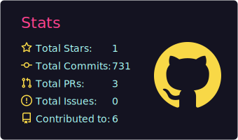
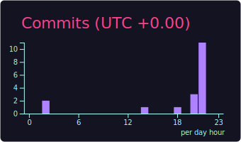
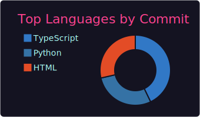

<!-- HERO -->

  

<h1 align="center">Andrés</h1>

  <b>Senior Frontend Engineer</b> · Angular · UI/UX · Clean Architecture

  I build scalable web apps with obsessive attention to UI quality, maintainability, and performance.

  
  
  

---

## ⚡ About
- **5+ years** building modern web apps
- **Angular (15–20)** · Signals · Zoneless · Clean Architecture
- Strong focus on **design systems**, accessibility, and UX polish
- Testing mindset: **Jest** · E2E when it matters

  
  
  
  
  

---

## 📊 GitHub
<!-- Responsive-ish layout: 2-up then 1 centered -->

  
  
  

---

  <i>Code is art when written with purpose.</i>

